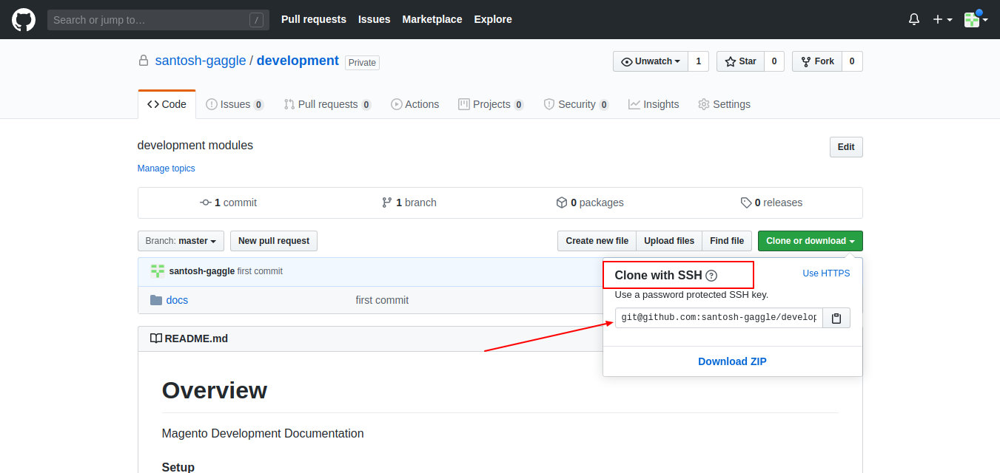

# GitHub Setup


**Steps To Install And Push Files To Repository**

 - *Step 1*
 
  Run below command in a directory
  
   ```bash
    git init
   ```

- *Step 2*

 For Adding Repository

 ```bash
 git remote add orgin your_repository_path
 ```
 > example: git remote add orgin https://github.com/santosh-gaggle/development.git

- *Step 3*

 Adding Files To Repository

 ```bash
 git add -A
 ```
 > note: -A means all files
 > also you can add single file with the path like :  git add readme.md

 - *Step 4*

 Adding Commit Msg On Files

 ```bash
 git commit -m "your_commit_msg"
 ```

- *Step 5*

 Finally Push To Repository

 ```bash
 git push orgin master
 ```

> After last command it will ask for user name and password 


## Key Setup for GitHub

>Go to your github repository and copy ssh path




>Paste the path of the ssh in config file that is placed here.
>.git/config


 ```bash

  [core]
    repositoryformatversion = 0
    filemode = true
    bare = false
    logallrefupdates = true
  [remote "orgin"]
    url = git@github.com:santosh-gaggle/development.git
    fetch = +refs/heads/*:refs/remotes/orgin/*

 ```

 ***Now go to in github setting***

 >Paste you pub key here


## Last and final step in your system find .ssh folder

> create a `config` file here if not available
> example : /home/santosh/.ssh

## Paste below code in the config file and change according to you

 ```bash
  Host github.com
  HostName github.com
  User git
  IdentityFile /home/santosh/.ssh/san

 ```
> Note: IdentityFile: give the path of your private key 
