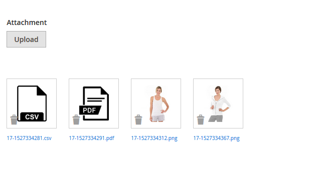

# Create image/file uploader widget


**add code in your phtml file**


- *In phtml file*


 ```bash
<div class="form_parent">
 <form class="form" method="post" id="frm_attachment" enctype="multipart/form-data" autocomplete="off">
  <div class="admin__field field field-email">
   <label class="label admin__field-label"><span>Attachment</span></label>
   <div class="admin__field-control control">
    <button type="button" class="scalable action-show-hide" id="uploadAttachment"><span><span><span>Upload</span></span></span></button>
    <input type="file" id="attachment" name="attachment" style="display: none;"/>
   </div>
  </div>
 </form>
</div>
<div id="attachmentFiles"></div>

<script>
    require(['jquery'], function ($) {
        $(document).ready(function ($) {
            
            $(document).on('click', '#attachmentFiles .action-remove', function(){
               if (window.confirm("Are you sure you want to delete?")) {
                   var attachmentPath = $(this).attr("data-image");
                   var divID = $(this).parents(".base-image").attr("id");
                   var imageID = $(this).parents(".base-image").find(".hiddneattachID").val();
                   
                   jQuery.ajax({
                        url: "<?php echo $block->getBaseUrl() . 'admin/hk/attachment/deleteAttachment?isAjax=true' ?>",
                        type: "POST",
                        data: {filename: attachmentPath, form_key: window.FORM_KEY, imageID:imageID},
                        showLoader: true,
                        success: function (response) {
                            if(response.success == true){
                                $(".base-image#"+divID).remove();
                            }
                            alert(response.message);
                        },
                       error: function (response) {
                            alert(response.message);
                       }
                    });
               } 
            });
            
            $('#uploadAttachment').click(function(){ $('#attachment').trigger('click'); });
            
            $("#attachment").change(function(){
                var data = $("#frm_attachment").get(0);
                
                jQuery.ajax({
                     url: "<?php echo $block->getBaseUrl() . 'admin/hk/attachment/addAttachment?isAjax=true' ?>",
                     type: "POST",
                     data: new FormData(data),
                     processData: false,
                     contentType: false,
                     showLoader: true,
                     success: function (response) {
                         alert(response.message);
                         $("#attachmentFiles").append(response.data.html);
                         $('#frm_attachment')[0].reset();
                     },
                    error: function (response) {
                         alert(response.message);
                         $('#frm_attachment')[0].reset();
                    }
                 });
            });
        });
    });
</script>
 ```

 - *create  addAttachment file in Controller*

  ```bash

	<?php

	namespace HK\Attachment\Controller\Adminhtml\Action;

	use Magento\Framework\Json\Helper\Data as JsonHelper;

	class AddAttachment extends \Magento\Backend\App\Action {
    
    protected $_mediaDirectory;
    protected $_fileUploaderFactory;
    public $_storeManager;

    public function __construct(
        \Magento\Backend\App\Action\Context $context,
        JsonHelper $jsonHelper,
        \Magento\Framework\Controller\Result\JsonFactory $resultJsonFactory,
        \Magento\Framework\Filesystem $filesystem,
        \Magento\MediaStorage\Model\File\UploaderFactory $fileUploaderFactory,
        \Magento\Store\Model\StoreManagerInterface $storeManager
    ) {
        parent::__construct($context);
        $this->jsonHelper = $jsonHelper;
        $this->resultJsonFactory = $resultJsonFactory;
        $this->_mediaDirectory = $filesystem->getDirectoryWrite(\Magento\Framework\App\Filesystem\DirectoryList::MEDIA);
        $this->_fileUploaderFactory = $fileUploaderFactory;
        $this->_storeManager = $storeManager;
    }

    public function execute(){
        
        $_postData = $this->getRequest()->getPost();
        
        $message = "";
        $newFileName = "";
        $error = false;
        $data = array();
        
        try{
            $target = $this->_mediaDirectory->getAbsolutePath('leads/');        
            
   //attachment is the input file name posted from your form
            $uploader = $this->_fileUploaderFactory->create(['fileId' => 'attachment']);
            
            //$_fileType = $uploader->getFileExtension();
            $newFileName = uniqid().'.'.$_fileType;
            
            /** Allowed extension types */
            $uploader->setAllowedExtensions(['jpg', 'jpeg', 'gif', 'png', 'pdf', 'doc', 'docx', 'xls', 'xlsx', 'csv']);
            /** rename file name if already exists */
            $uploader->setAllowRenameFiles(true);
            
            $result = $uploader->save($target, $newFileName); //Use this if you want to change your file name
   //$result = $uploader->save($target);
            if ($result['file']) {
                
                $_mediaUrl = $this->_storeManager->getStore()->getBaseUrl(\Magento\Framework\UrlInterface::URL_TYPE_MEDIA);
                $_iconArray = array(
                    'pdf' => $_mediaUrl.'leads/default/icon-pdf.png',
                    'doc' => $_mediaUrl.'leads/default/icon-doc.png',
                    'docx' => $_mediaUrl.'leads/default/icon-docx.png',
                    'xls' => $_mediaUrl.'leads/default/icon-xls.png',
                    'xlsx' => $_mediaUrl.'leads/default/icon-xlsx.png',
                    'csv' => $_mediaUrl.'leads/default/icon-csv.png',
                );
                
                if(isset($_iconArray[$_fileType])){
                    $_src = $_iconArray[$_fileType];
                }else{
                    $_src = $_mediaUrl.'leads/'.$newFileName;
                }
                
                $error = false;
                $message = "File has been successfully uploaded";
                
                $html = '<div class="image item base-image" data-role="image" id="'. uniqid().'">
                            <div class="product-image-wrapper">
                                
                                <div class="actions">
                                    <button type="button" class="action-remove" data-role="delete-button" data-image="'.$newFileName.'" title="Delete image"><span>Delete image</span></button>
                                </div>
                                <div class="image-fade"><span>Hidden</span></div>
                            </div>
                            <div class="item-description">
                                <div class="item-title" data-role="img-title"></div>
                                <div class="item-size">
                                    <a href="'.$_mediaUrl.'leads/'.$newFileName.'" target="_blank"><span data-role="image-dimens">'.$newFileName.'</span></a>
                                </div>
                            </div>
                        </div>';
                
                $data = array('filename' => $newFileName, 'path' => $_mediaUrl.'leads/'.$newFileName, 'fileType' => $_fileType, 'html' => $html);
            }
        } catch (\Exception $e) {
            $error = true;
            $message = $e->getMessage();
        }
        
        $resultJson = $this->resultJsonFactory->create();

        return $resultJson->setData([
                    'message' => $message,
                    'data' => $data,
                    'error' => $error
        ]);
    }
}

 ```

 - *create  DeleteAttachment file in Controller*


 ```bash

	<?php

namespace HK\Attachment\Controller\Adminhtml\Action;

use Magento\Framework\Json\Helper\Data as JsonHelper;

class DeleteAttachment extends \Magento\Backend\App\Action {
    
    protected $_mediaDirectory;
    protected $_fileUploaderFactory;
    public $_storeManager;
    protected $_file;

    public function __construct(
        \Magento\Backend\App\Action\Context $context,
        JsonHelper $jsonHelper,
        \Magento\Framework\Controller\Result\JsonFactory $resultJsonFactory,
        \Magento\Framework\Filesystem $filesystem,
        \Magento\MediaStorage\Model\File\UploaderFactory $fileUploaderFactory,
        \Magento\Store\Model\StoreManagerInterface $storeManager,
        \Magento\Framework\Filesystem\Driver\File $file
    ) {
        parent::__construct($context);
        $this->jsonHelper = $jsonHelper;
        $this->resultJsonFactory = $resultJsonFactory;
        $this->_mediaDirectory = $filesystem->getDirectoryWrite(\Magento\Framework\App\Filesystem\DirectoryList::MEDIA);
        $this->_fileUploaderFactory = $fileUploaderFactory;
        $this->_storeManager = $storeManager;
        $this->_file = $file;
    }

    
    public function execute(){
        
        $_postData = $this->getRequest()->getPost();
        
        $message = "";
        $newFileName = "";
        $success = false;
        
        $mediaRootDir = $this->_mediaDirectory->getAbsolutePath();
        $_fileName = $mediaRootDir .'leads/'. $_postData['filename'];
        if ($this->_file->isExists($_fileName))  {
            try{
                $this->attachment->load($_postData['imageID']);
                $this->attachment->delete();
                
                $this->_file->deleteFile($_fileName);
                $message = "File removed successfully.";
                $success = true;
            } catch (Exception $ex) {
                $message = $e->getMessage();
                $success = false;
            }
        }else{
            $message = "File not found.";
            $success = false;
        }
        
        $resultJson = $this->resultJsonFactory->create();

        return $resultJson->setData([
                    'message' => $message,
                    'data' => '',
                    'success' => $success
        ]);         
    }
}

 ```

 -*after implemetation it will look like this*





> Here is all icon png image that's used for files

     


